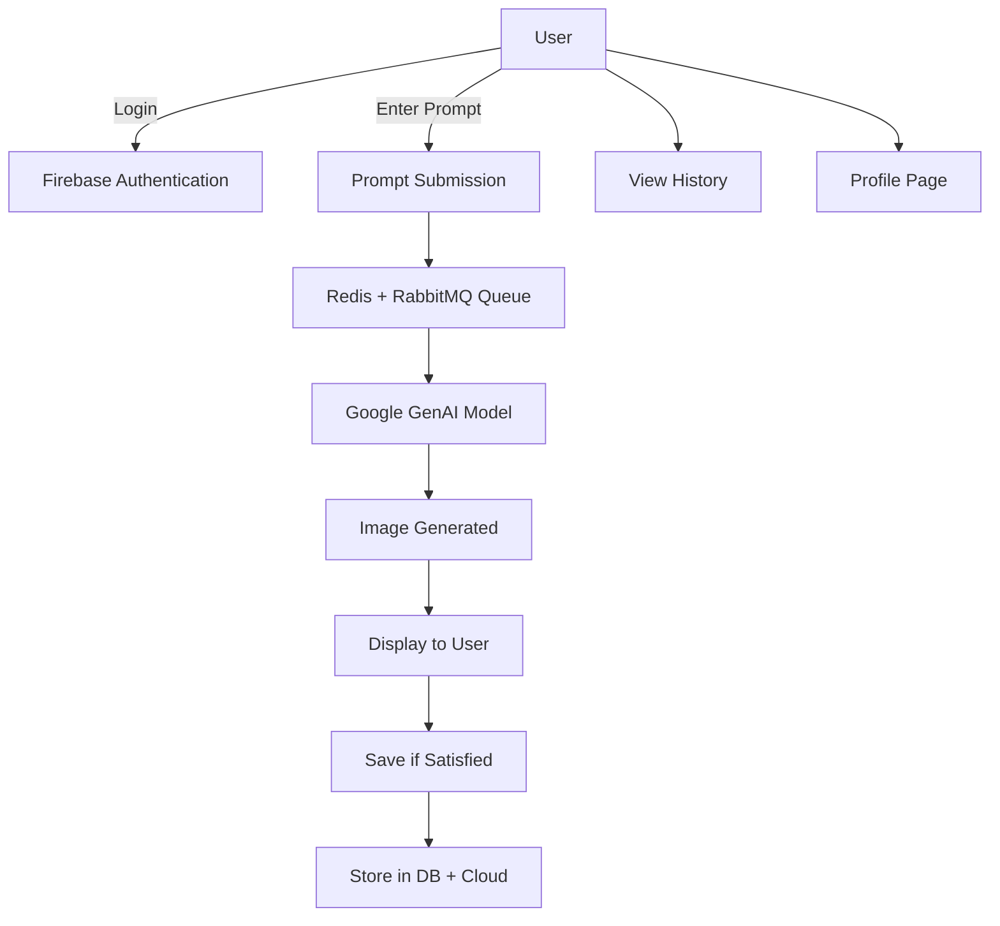
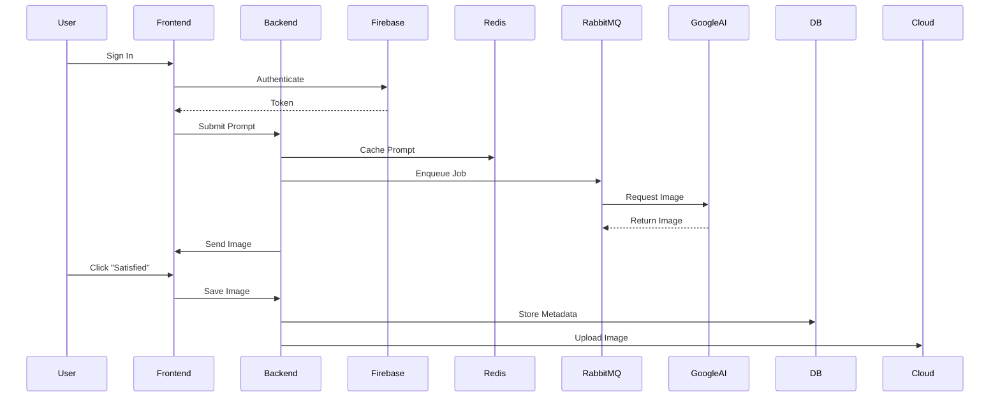
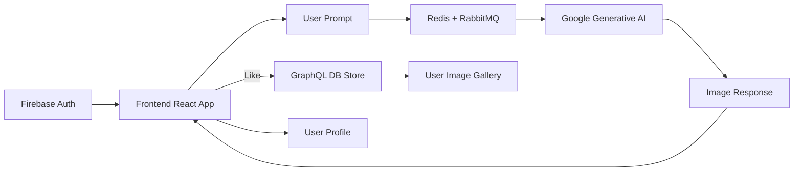

# 🧠 IMAGEN — Full Stack Generative AI Image Platform

**IMAGEN** is a production-grade, full-stack AI-powered image generation platform. Users input text prompts, and our system transforms them into stunning images using Google’s cutting-edge Generative AI. It features Firebase-authenticated user sessions, history tracking, image gallery, fast server response using Redis, GraphQL for efficient querying, and a clean UI powered by modern frontend frameworks.

---

## 🚀 Features

* 🔐 **Authentication** — Secure user login via Firebase
* 🧠 **AI Generation** — Text-to-image via Google Generative AI
* 📜 **GraphQL** — Fetch only the necessary image metadata
* 📸 **User History** — View previously generated images
* 🖼️ **Gallery** — Interactive gallery of all generated content
* ⚡ **High Performance** — Redis-backed response acceleration
* 🗂️ **Profile Page** — Personalized user dashboard
* 🐇 **Efficient Queuing** — RabbitMQ handles background image generation
* 🐳 **Containerized** — Docker-powered seamless deployment
* 🌐 **Frontend** — React + TypeScript + TailwindCSS
* 🔧 **Backend** — Node.js + Express + GraphQL + TypeScript

---

## 🧠 System Architecture

### 🔁 Use Case Diagram



---

### 🕰️ Sequence Diagram



---

### 🔄 Flow Diagram



---

## 🔧 Tech Stack

### 🔹 Frontend

* React.js + TypeScript
* Tailwind CSS
* Redux Toolkit
* Vite

### 🔸 Backend

* Node.js + Express + TypeScript
* GraphQL
* Redis (Caching)
* RabbitMQ (Queueing)
* Firebase (Authentication)
* Google Generative AI API
* Cloudflare (Image Storage)
* Docker (Containerization)

---

## 📁 Folder Structure

```
IMAGEN/
├── client/                 # React + TS + Vite + Tailwind
│   └── src/
│       └── components/
│       └── pages/
│       └── graphql/
├── server/                 # Express + GraphQL  + AI Logic
│   └── resolvers/
│   └── models/
│   └── queues/
├── docker/                 # Docker setup
├── docs/                   # System Design, Diagrams
└── README.md
```

---

## 📦 Local Development Setup

```bash
# Clone the repository
git clone https://github.com/jayanth119/IMAGEN.git
cd IMAGEN

# Install Frontend
cd client
npm install
npm run dev

# Install Backend
cd ../server
npm install
npm run dev
```

> ⚠️ Ensure Redis, RabbitMQ, and Docker are up before running the backend.

---

## 🐳 Docker Deployment

```bash
# Build and run everything with Docker Compose
docker-compose up --build
```

---

## ✨ Future Enhancements

* 🧑‍🎨 Image inpainting & editing
* 📊 Prompt analytics
* 📈 Performance monitoring dashboard
* 🎭 Role-based access (admin, power user, guest)
* ♾️ Infinite scroll for gallery
* 🧩 Multi-model support for text-to-image

---

## 🤝 Contributing

We welcome all kinds of contributions!

1. Fork the repo
2. Create a new branch (`git checkout -b feature-xyz`)
3. Commit your changes (`git commit -am 'Add some feature'`)
4. Push to the branch (`git push origin feature-xyz`)
5. Open a Pull Request

---

## 📬 Contact

Feel free to reach out at [chjayanth119@gmail.com](mailto:chjayanth119@gmail.com)
Follow me on GitHub: [@jayanth119](https://github.com/jayanth119)