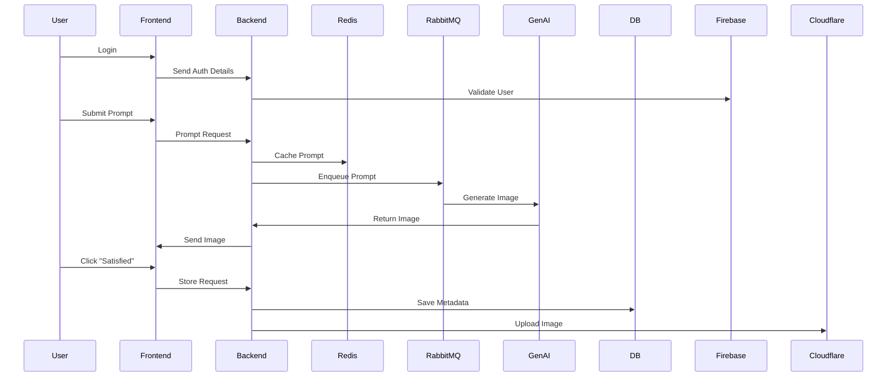

# 🧠 Imagen — AI-Powered Image Generation Platform

**Imagen** is a cutting-edge AI-powered image generation application that allows users to transform text prompts into visually stunning images using Google’s advanced generative models. The app ensures seamless authentication, smart prompt queuing, image generation, cloud storage, and interactive gallery display—all with industry-level architecture and technologies.

---

## 🔥 Features

- 🔐 Secure authentication (Firebase)
- 🧾 Text-to-image prompt input
- 🎨 AI image generation using Google Generative AI
- ✅ User feedback ("Satisfied" logic to store)
- 🖼️ Gallery of previously generated images
- 📦 Efficient task queueing with RabbitMQ + Redis
- ☁️ Cloud image storage (Cloudflare)
- ♻️ State management with Redux Toolkit
- 🚢 Containerized deployment with Docker
- 🌐 Built with modern frontend (React + Tailwind + Vite) and backend (Express + TypeScript)

---

## 🛠️ Tech Stack

### Frontend:
- ReactJS + TypeScript
- Tailwind CSS
- Vite
- Redux Toolkit

### Backend:
- Node.js + Express (with TypeScript)
- Redis (Caching)
- RabbitMQ (Message Queue)
- Firebase (Auth & Database)
- Docker (Containerization)
- Google Gemini API (for Prompt Understanding)
- Google Generative Image Model (for Image Creation)

---

## 📊 System Architecture & Diagrams

### 📌 MerMITE - Activity Diagram

```mermaid
flowchart TD
    A[User Authenticates] --> B[Submits Prompt]
    B --> C[Prompt sent to Queue]
    C --> D[Model generates Image]
    D --> E[Image Displayed to User]
    E --> F{User Satisfied?}
    F -->|Yes| G[Store Image in DB + Cloud]
    F -->|No| H[Discard Image]
    G --> I[Display in User's Gallery]
````

---

### 📌 MerMITE - Flow Diagram

```mermaid
flowchart LR
    Auth[Authentication] --> UI[Frontend App]
    UI --> Prompt[Prompt Submit]
    Prompt --> Queue[Add to Redis/RabbitMQ Queue]
    Queue --> Model[Google GenAI Model]
    Model --> Image[Generate Image]
    Image --> UI
    UI -->|Like| DB[Store in DB]
    DB --> Gallery[User Gallery View]
```

---

### 📌 MerMITE - Sequence Diagram



---

## 🖼️ System UI Overview


---

## 🧪 Local Development Setup

```bash
# Clone the repo
git clone https://github.com/jayanth119/Imagen.git
cd Imagen

# Install frontend
cd client
npm install
npm run dev

# Install backend
cd ../server
npm install
npm run dev
```

> Ensure Docker, Redis, and RabbitMQ are up and running before starting the backend.

---

## 🚀 Deployment (Dockerized)

```bash
# Build and start services
docker-compose up --build
```

---

## 🗃️ Folder Structure

```
Imagen/
├── client/                # React + Vite + Tailwind + Redux Toolkit
├── server/                # Express + TS + AI API Logic
├── docker/                # Docker configuration
├── docs/                  # Diagrams & Charts
└── README.md
```

---

## ✨ Future Enhancements

* Support for multi-model selection
* Image editing (masking, inpainting)
* Role-based access (admin vs user)
* Prompt analytics and image insights
* Infinite scroll in Gallery

---

## 🤝 Contributing

We welcome contributions! Please fork the repo and submit a PR.

---


```
